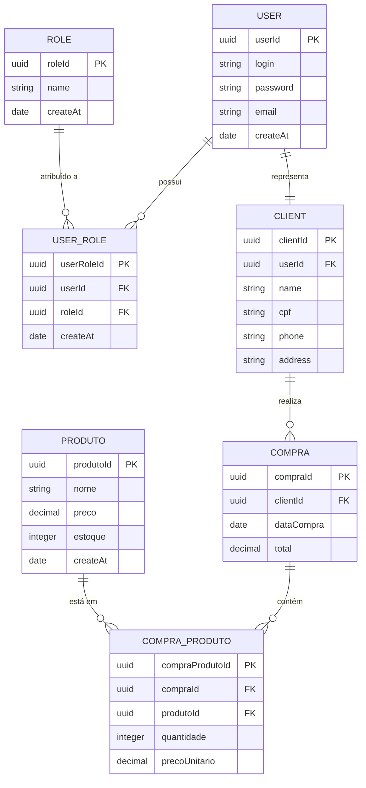

# Backend E-commerce

Sistema backend para uma plataforma de e-commerce desenvolvida com boas práticas e arquitetura moderna.

## 📋 Índice

- [Visão Geral](#visão-geral)
- [Tecnologias](#tecnologias)
- [Estrutura do Banco de Dados](#estrutura-do-banco-de-dados)
- [Funcionalidades](#funcionalidades)
- [Configuração do Ambiente](#configuração-do-ambiente)
- [Como Executar](#como-executar)
- [Endpoints da API](#endpoints-da-api)

## 🎯 Visão Geral

Este projeto é um backend robusto para e-commerce que gerencia usuários, produtos, clientes e compras. O sistema inclui autenticação, autorização baseada em papéis (RBAC) e operações completas de e-commerce.

## 🚀 Tecnologias

- Linguagem de Programação: [Especificar]
- Framework: [Especificar]
- Banco de Dados: [Especificar]
- Autenticação: JWT
- Documentação da API: [Especificar]

## 🗄️ Estrutura do Banco de Dados

O diagrama abaixo representa a estrutura do banco de dados do sistema:

